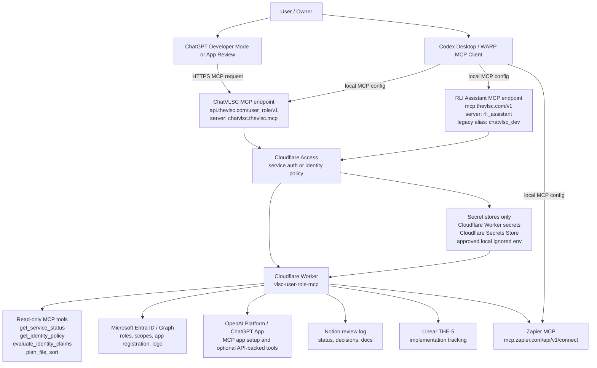

# ChatVLSC MCP Connection Flow Map

Status date: 2026-07-10
Risk level: 6 for documentation and unauthenticated probes only

## Current Evidence

- Prior reviewed public mirror commit: https://github.com/The-VLSC/brain-slushie/commit/a3e97ffdb63e098d5b983828eded8ec773041eb5
- Secure gate command: `pnpm run test:connectivity`
- Latest local gate result: 10 passed, 0 failed
- Cloudflare WARP: connected and network healthy
- Services: `cloudflared`, `CloudflareWARP`, and `CloudflareWARPUpdater` are running
- Primary ChatVLSC current and RLI Assistant probes: Cloudflare Access redirect for unauthenticated requests
- Zapier MCP probe: auth-required for unauthenticated requests
- Cloudflare Access API check: current token is denied for Access apps and service tokens
- OpenAI Platform target listing: connector rejected the target request in this session

## Connection Flow

## OpenAI / ChatGPT Path

1. Keep the app archetype as `interactive-decoupled`.
2. Expose one stable public HTTPS MCP endpoint for ChatGPT:
   - Primary: `https://api.thevlsc.com/user_role/v1/`
   - Secondary: `RLI Assistant` at `https://mcp.thevlsc.com/v1/`
   - Legacy compatibility alias: `chatvlsc_dev`
3. In ChatGPT, enable Developer Mode and create a connector/app using the public MCP URL.
4. ChatGPT should see tool descriptors after the connection succeeds.
5. For production or submission, use a concrete working MCP endpoint, not a placeholder.
6. Keep tool metadata clear, specific, and split read/write behavior into separate tools.

Official OpenAI docs used:

- https://developers.openai.com/apps-sdk/build/mcp-server
- https://developers.openai.com/apps-sdk/plan/tools
- https://developers.openai.com/apps-sdk/deploy/connect-chatgpt
- https://developers.openai.com/apps-sdk/build/auth
- https://developers.openai.com/apps-sdk/deploy/testing
- https://developers.openai.com/apps-sdk/deploy/submission

## Auth And Identity Flow

ChatGPT app auth and Cloudflare Access are related but not identical:

1. Cloudflare Access protects the public MCP route today and correctly blocks unauthenticated requests.
2. ChatGPT MCP OAuth still needs MCP protected-resource metadata and an OAuth/OIDC authorization server flow.
3. The MCP server must return a `401` challenge with `WWW-Authenticate` metadata when OAuth linking is required.
4. Entra ID is the preferred OIDC identity provider for owner/admin interactive auth.
5. ChatGPT uses authorization code + PKCE; the MCP server must verify issuer, audience, expiry, replay risk, and scopes on every request.
6. SAML and SCIM remain planning-only unless a specific downstream client requires them.

## Connector Responsibilities

| Connector or client | Current role | Current status | Next gate |
| --- | --- | --- | --- |
| ChatGPT / OpenAI Apps | Primary MCP client and app surface | Ready for Developer Mode after auth route is finalized | Public HTTPS MCP URL plus OAuth metadata and Platform access |
| OpenAI Platform | App creation, review, optional API key target | Target listing rejected by connector | Platform admin access or retry after account/auth refresh |
| Codex / WARP MCP | Local development client | Configured for `chatvlsc.thevlsc.mcp` on primary ChatVLSC current, `rli_assistant` on the secondary route, legacy `chatvlsc_dev`, and Zapier entries | Keep using no-secret local probes |
| Cloudflare One / Access | Route protection and service auth | WARP healthy, Access blocks unauthenticated probes | Token with Access Apps/Policies and Service Tokens permissions |
| cloudflared | Tunnel/service connectivity | Service running | Keep tunnel token only in service config |
| Zapier MCP | Automation connector bridge | Configured, auth-required | Complete Zapier OAuth before tool use |
| Linear | Work tracking | THE-5 active and updated | Keep gating comments current |
| Notion | Review and decision log | Private review note created | Move to durable shared page/database if needed |
| Microsoft Entra / Graph | SSO/OIDC, roles, scopes, logo, app registration | Config planned, writes gated | Clean Graph credential with app-registration write permission |
| Azure OpenAI | Optional backend model provider | Not wired as runtime secret | Choose provider and store key only in approved secret store |

## Minimal Next Sequence

1. Keep the ChatGPT connector URL normalized to primary ChatVLSC current: `https://api.thevlsc.com/user_role/v1/`.
2. Use `RLI Assistant` for the `https://mcp.thevlsc.com/v1/` secondary route and migrate clients from `chatvlsc_dev` to `rli_assistant`.
3. Add MCP OAuth protected-resource metadata endpoints to the Worker.
4. Configure Entra OIDC app registration redirect URI for ChatGPT connector OAuth.
5. Create Cloudflare Access service token for machine clients and store it outside source.
6. Retest authenticated production `initialize` and `tools/list`.
7. Complete Zapier OAuth and retest Zapier MCP from the configured client.
8. Re-run `pnpm run test:connectivity`.
9. Create the app in ChatGPT Developer Mode or OpenAI Platform once Platform access works.
10. Record the result in Linear and Notion.

## Do Not Do

- Do not copy Cloudflare Access login URLs or signed query strings into source, Notion, Linear, or chat.
- Do not store Cloudflare Access client secrets in `.mcp.json`.
- Do not use mixed login handoff text as a Microsoft Graph token.
- Do not submit the app publicly until the MCP endpoint, OAuth metadata, CSP, privacy/support URLs, screenshots, and test prompts are ready.
