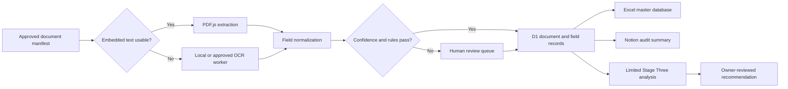

# RLI OCR System Design

## Scope

This design separates local experiment evidence from a future production ingestion path. No production document ingestion is enabled by this design alone.

## Trust Boundaries

| Boundary | Responsibility | Current state |
| --- | --- | --- |
| Local experiment | Generate fixtures, extract text, test accuracy, build workbook | Implemented |
| Public WWW Worker | Show synthetic metrics and plan-only workflow UI | Implemented; no source data |
| Protected MCP Worker | Expose OCR status/schema and identity-aware operations | Access protected |
| D1 | Store normalized document, page, field, and review metadata | Schema and integrity migration applied; application rows empty |
| Private object storage | Hold approved source documents when retention is settled | Not enabled |
| Notion | Review status, decisions, and deployment evidence | Enabled as control surface |
| OpenAI/Workers AI | Analyze small approved batches after extraction | Server-side binding gate; production use not approved |

## Data Contracts

### Document Record

- Stable document identifier generated by the ingestion service.
- Source type and sanitized source reference.
- Page count, selected extraction engine, and aggregate confidence.
- Review state, integrity hash, timestamps, and processing version.

### Field Record

- Document identifier and normalized field name.
- Sanitized value appropriate for the approved database.
- Confidence, page reference, extraction engine, and review state.
- Original page text is not required for the default record.

### Review Event

- Reviewer identity from verified claims.
- Before/after field state, reason, timestamp, and workflow correlation ID.
- No credentials, access tokens, passwords, or recovery material.

## Processing Rules

1. Admit documents only from an approved manifest or authenticated upload surface.
2. Hash before processing and make ingestion idempotent.
3. Prefer embedded text; OCR only when required.
4. Apply field-specific validation instead of one global confidence score.
5. Prevent automatic acceptance when required fields are missing or contradictory.
6. Record human corrections as immutable review events.
7. Send only the minimum approved fields to Stage Three analysis.
8. Never expose source files, private paths, or workbook downloads through the public Worker.

## Failure Handling

- Unsupported or corrupt PDF: quarantine metadata and request review.
- OCR timeout: retry within a bounded workflow, then stop for review.
- Duplicate hash: return the prior result instead of creating a second record.
- D1 write failure: do not mark the document complete; retain the workflow correlation ID.
- Stage Three unavailable: preserve the extracted record and leave analysis pending.
- Workbook build failure: report the failed sheet/check without changing source records.

## Observability

Log structured event metadata only: correlation ID, stage, duration, engine, page count, confidence band, outcome, and error class. Do not log source text, field values, filesystem paths, authorization headers, or secret identifiers.

## Deployment Sequence

1. Keep the synthetic benchmark as the regression gate.
2. Approve private storage, retention, and jurisdiction.
3. Run a de-identified validation corpus and set field thresholds.
4. Enable manifest-based ingestion for a restricted operator group.
5. Verify D1 idempotency, review events, and rollback behavior.
6. Enable limited Stage Three analysis only after its server-side credential and data-minimization review pass.
7. Expand scope only with measured accuracy and owner sign-off.

## Changes

- Defines a two-branch extraction pipeline and explicit human-review boundary.
- Separates public evidence, protected operations, metadata storage, private objects, and external analysis.
- Establishes no-source-data logging and idempotent ingestion requirements.

## User Impact

Authorized operators receive a reviewable workflow with clear failure states. Public users can inspect synthetic readiness evidence without gaining access to operational records.

## App and Skill Usage

- Cloudflare Workers and Workflows provide protected request handling and bounded orchestration.
- D1 stores normalized metadata and review history.
- Local Tesseract.js and PDF.js provide the initial extraction engines.
- Excel provides an operator-facing master view; it is not the system of record.
- Notion and GitHub receive sanitized decision and configuration evidence.
